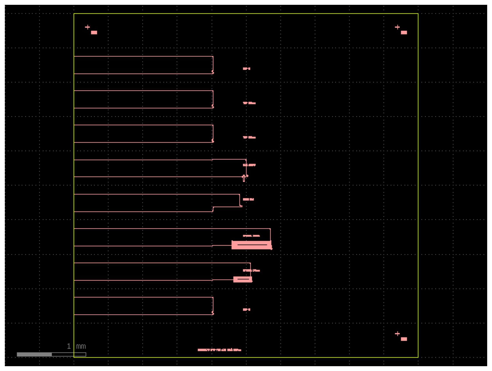

# cpo-pic

A passive photonic test die for glass-substrate co-packaged optics,
designed as the chip-side counterpart of my end-to-end connectivity
study ([nanodevo.github.io/reports/optical-connectivity](https://nanodevo.github.io/reports/optical-connectivity.html)).

The interface it is built to mate with is the published glass-substrate
architecture (Brusberg et al., *Glass Substrate for Co-Packaged Optics*,
IMAPS 2022; OFC 2020/2022/2025/2026): fibers enter an MPO-16 connector
butt-coupled at the polished edge of an ion-exchanged (IOX) glass
waveguide substrate, and the photonic die sits face-down on that glass,
coupling evanescently through a ~1 um adhesive bondline.



## Interface contract

| Parameter | Value | Why |
|---|---|---|
| Coupler channels | 16 @ 250 um pitch, west edge | one per fiber of the MPO-16 connector |
| Coupler type | linear adiabatic taper, 2 mm, 500 nm -> 150 nm tip | the evanescent-transfer half of the glass-to-PIC joint |
| Topology | odd-in / even-out loopbacks | a fiber array on the glass grades every interface in transmission |
| Die | 5 x 5 mm | same class as the SiN test chips in the IMAPS paper |
| Fiducials | cross + Vernier, 3 corners | read through a split optic at placement; Vernier resolves residual misalignment |

## Channel plan

| Channels | Structure | Extracts |
|---|---|---|
| 1-2 | reference loopback | baseline insertion loss |
| 3-4 | + 0.5 cm spiral | cutback pair: |
| 5-6 | + 2.0 cm spiral | propagation loss per cm |
| 7-8 | add-drop ring (R = 10 um) | group index, Q |
| 9-10 | unbalanced MZI (dL = 100 um) | FSR sanity check |
| 11-12 | taper split, 120 nm tip | coupler DOE: |
| 13-14 | taper split, 180 nm tip | tip-width sensitivity |
| 15-16 | duplicate reference | channel uniformity |

## Run

```bash
python -m venv .venv && .venv/bin/pip install gdsfactory
.venv/bin/python chip.py     # writes build/cpo_pic.gds and build/cpo_pic.png
```

Layout is generated with [gdsfactory](https://gdsfactory.github.io/gdsfactory/)
on the generic 220 nm SOI strip-waveguide PDK. The design intent lives in
the cell parameters, not the process: retargeting to a foundry PDK is a
cross-section swap.

## Roadmap

- Mode solver (femwell) on the taper cross-sections: effective-index
  walk along the 2 mm taper, adiabaticity check
- FDTD (MEEP) on the tip region
- DRC against a public foundry rule deck
- Retarget to a SiN platform (closer index match to IOX glass)

## References

- L. Brusberg et al., "Glass Substrate for Co-Packaged Optics",
  IMAPS 2022, pp. 236-241
- L. Brusberg et al., "Integrated Glass Waveguide Substrate with Surface
  Coupled Photonic Chips for Massive Scaling of CPO", OFC 2026, Th3C.2
- Full reference list and the physics: the
  [connectivity study](https://nanodevo.github.io/reports/optical-connectivity.html)
