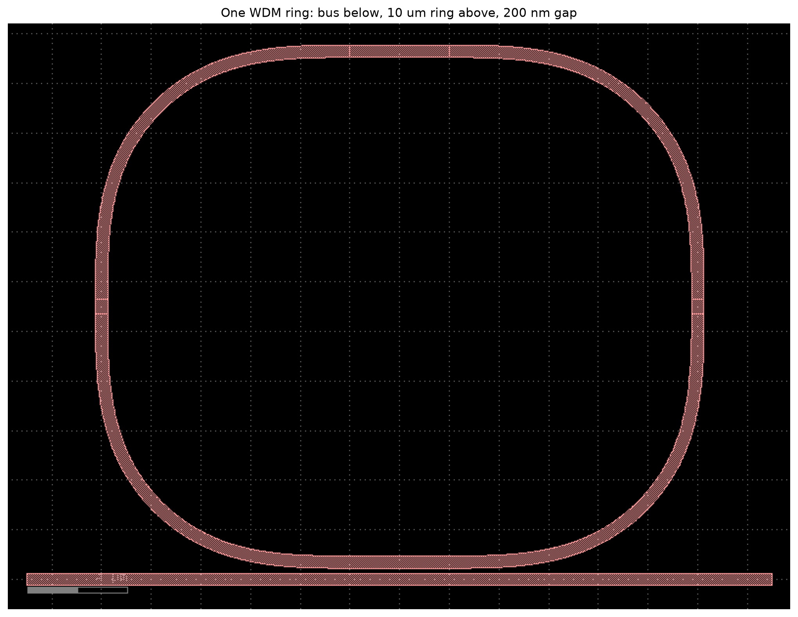
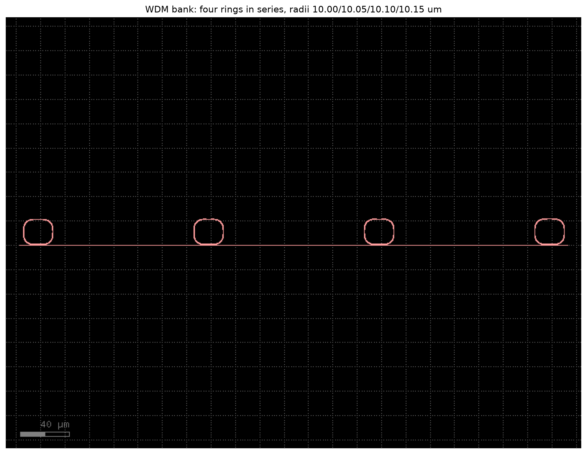
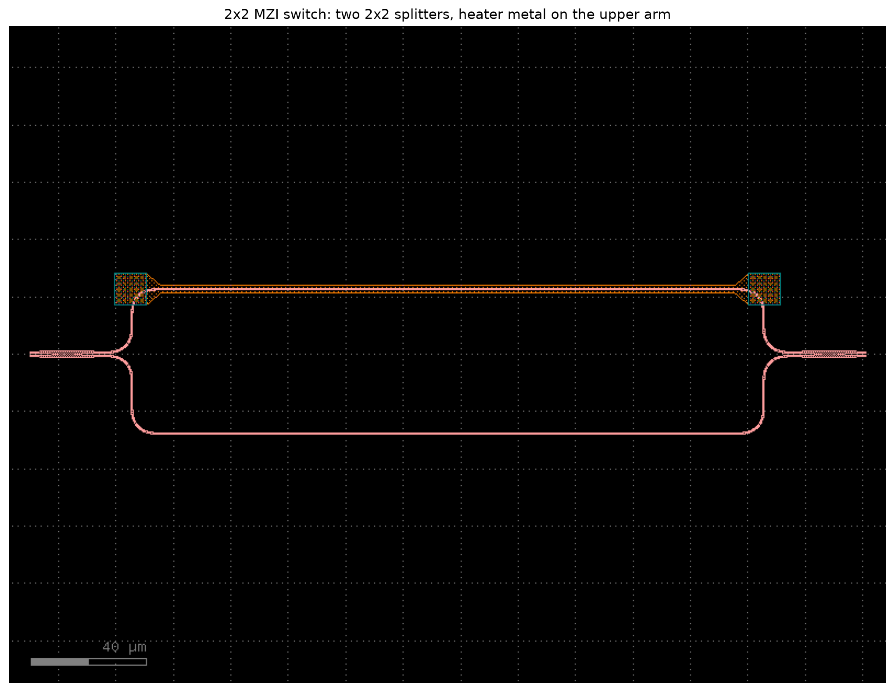
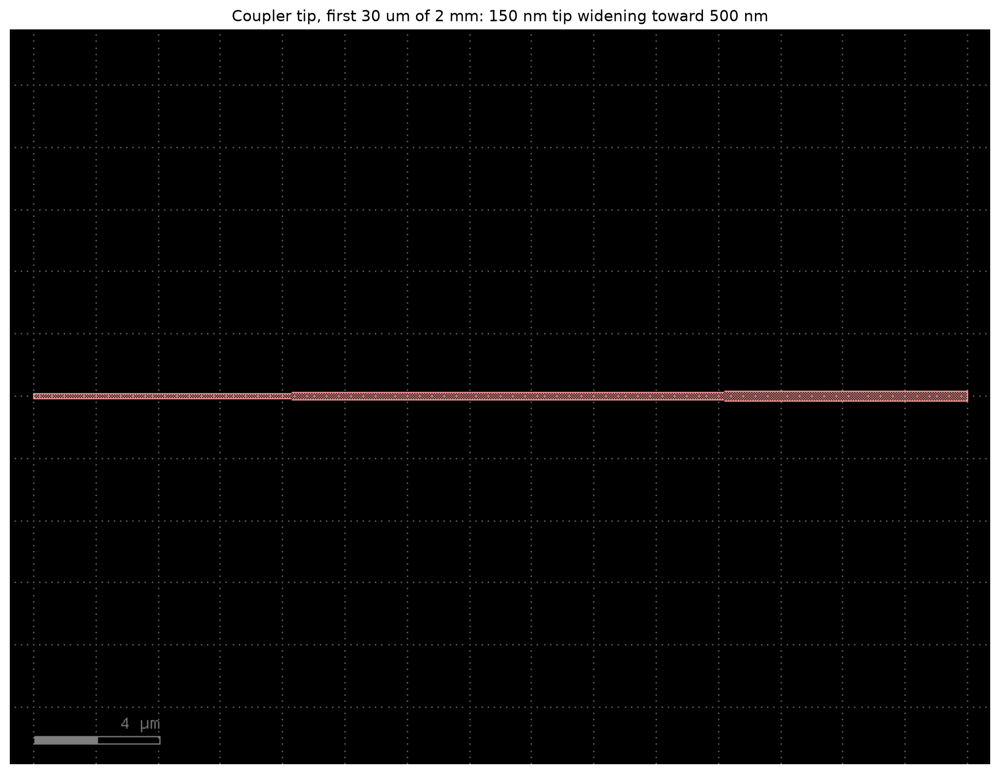
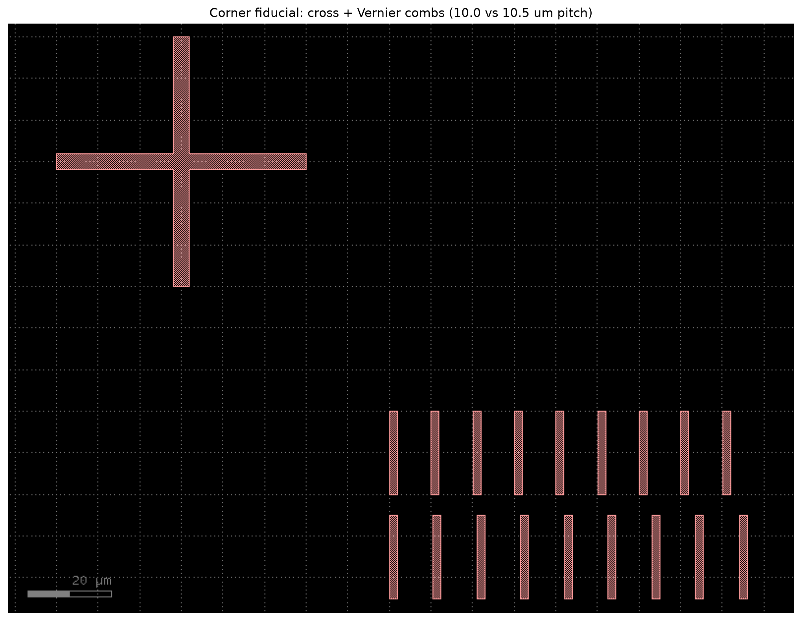
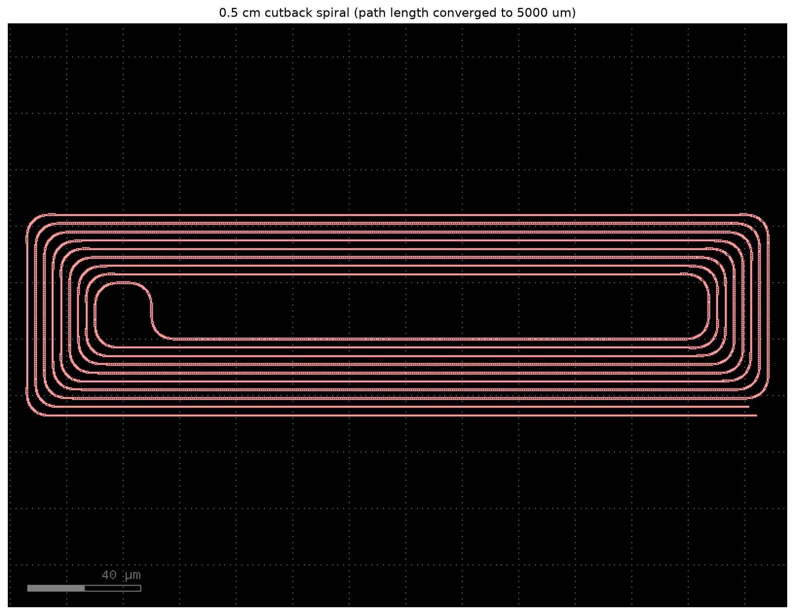

# cpo-pic

A passive photonic test die for glass-substrate co-packaged optics,
designed as the chip-side counterpart of my end-to-end connectivity
study ([nanodevo.github.io/reports/optical-connectivity](https://nanodevo.github.io/reports/optical-connectivity.html)).

The interface it is built to mate with is the published glass-substrate
architecture (Brusberg et al., *Glass Substrate for Co-Packaged Optics*,
IMAPS 2022; OFC 2020/2022/2025/2026): fibers enter an MPO-16 connector
butt-coupled at the polished edge of an ion-exchanged (IOX) glass
waveguide substrate, and the photonic die sits face-down on that glass,
coupling evanescently through a ~1 um adhesive bondline.

**[Rotate the full assembly in interactive 3D](https://nanodevo.github.io/reports/cpo-3d.html)** -
fibers, MPO-16 connector, IOX glass substrate, this PIC, and the switch ASIC.


## Interface contract

| Parameter | Value | Why |
|---|---|---|
| Coupler channels | 16 @ 250 um pitch, west edge | one per fiber of the MPO-16 connector |
| Coupler type | linear adiabatic taper, 2 mm, 500 nm -> 150 nm tip | the evanescent-transfer half of the glass-to-PIC joint |
| Topology | odd-in / even-out loopbacks | a fiber array on the glass grades every interface in transmission |
| Die | 5 x 5 mm | same class as the SiN test chips in the IMAPS paper |
| Fiducials | cross + Vernier, 3 corners | read through a split optic at placement; Vernier resolves residual misalignment |

## Channel plan

| Channels | Structure | Extracts |
|---|---|---|
| 1-2 | reference loopback | baseline insertion loss |
| 3-4 | + 0.5 cm spiral | cutback pair: |
| 5-6 | + 2.0 cm spiral | propagation loss per cm |
| 7-8 | 4-ring WDM bank, staggered radii | transceiver demux skeleton; per-ring group index, Q |
| 9-10 | 2x2 thermo-optic MZI switch cell | the engine's routing element; heater metal drawn, graded passively |
| 11-12 | taper split, 120 nm tip | coupler DOE: |
| 13-14 | taper split, 180 nm tip | tip-width sensitivity |
| 15-16 | duplicate reference | channel uniformity |

The die is deliberately half interface-qualification vehicle, half
optical-engine skeleton: the loopbacks, cutbacks and taper splits grade
the glass-to-PIC interface (what must be proven first), while the WDM
ring bank and the 2x2 thermo-optic switch cell are the passive optical
circuit of the transceiver engine that would sit beside a switch ASIC
in a co-packaged optics assembly. The active layers (Ge photodiodes,
junction modulators, drivers) belong to the EIC/foundry side; the
PIC-to-ASIC connection is electrical, through the bumps and RDL of the
glass substrate.

## Cell gallery

The die overview above is at 5 mm scale; the devices are micrometers.
What each cell actually looks like (`python figures.py` regenerates):

**One WDM ring** - a 10 um racetrack next to a bus waveguide, 200 nm
apart. Light at the ring's resonant wavelengths couples across the gap,
circulates, and is removed from the bus: a wavelength filter with no
moving parts.



**The 4-ring WDM bank** (channels 7-8) - four such rings in series with
radii staggered by 50 nm, so each one filters a different wavelength
comb: the demultiplexer skeleton of a transceiver.



**The 2x2 thermo-optic switch** (channels 9-10) - light splits into two
arms and recombines; the orange metal on the upper arm is a resistive
heater. Heating one arm shifts its phase and steers the light between
the two outputs: the routing element of an optical engine.



**The coupler tip** (first 30 um of the 2 mm taper) - the waveguide
narrows to 150 nm, forcing the mode to expand out of the silicon so it
can transfer evanescently to the IOX guide in the glass below.



**Corner fiducial** - the cross and Vernier combs a vision-based die
bonder reads through a split optic at placement; the Vernier resolves
residual misalignment to 0.5 um.



**Cutback spiral** - 0.5 cm of waveguide coiled into 1 mm; together
with the 2 cm version and the references, propagation loss per cm
falls out of a linear fit.



## Run

```bash
python -m venv .venv && .venv/bin/pip install gdsfactory
.venv/bin/python chip.py     # writes build/cpo_pic.gds and build/cpo_pic.png
```

Layout is generated with [gdsfactory](https://gdsfactory.github.io/gdsfactory/)
on the generic 220 nm SOI strip-waveguide PDK. The design intent lives in
the cell parameters, not the process: retargeting to a foundry PDK is a
cross-section swap.

## The optical chain

`chain/` is an explainer that follows the light through the whole assembly,
one stage at a time: the fiber that delivers it, the ion-exchanged waveguides
in the glass, the transfer onto this die, the circuit on it, and the point
where photons become electrons. Each stage carries the physics, the equations
and where they come from, and experiments that can be re-run.

| Page | Covers |
|---|---|
| [Overview](chain/index.html) | the five stages, and which simulation tool belongs to each |
| [Foundations: rays](chain/rays.html) | focal length, thick lenses, spherical aberration measured with a ruler |
| [Stage 1: the fiber](chain/fiber.html) | why one mode survives, how wide it is, why the datasheet disagrees with the textbook |
| [Mode explorer](chain/fiber-mode.html) | interactive: solves the exact Bessel mode in the browser |

Stages 2 to 5 are in progress.

## Roadmap

- Mode solver (femwell) on the taper cross-sections: effective-index
  walk along the 2 mm taper, adiabaticity check
- FDTD (MEEP) on the tip region
- DRC against a public foundry rule deck
- Retarget to a SiN platform (closer index match to IOX glass)

## References

- L. Brusberg et al., "Glass Substrate for Co-Packaged Optics",
  IMAPS 2022, pp. 236-241
- L. Brusberg et al., "Integrated Glass Waveguide Substrate with Surface
  Coupled Photonic Chips for Massive Scaling of CPO", OFC 2026, Th3C.2
- Full reference list and the physics: the
  [connectivity study](https://nanodevo.github.io/reports/optical-connectivity.html)
